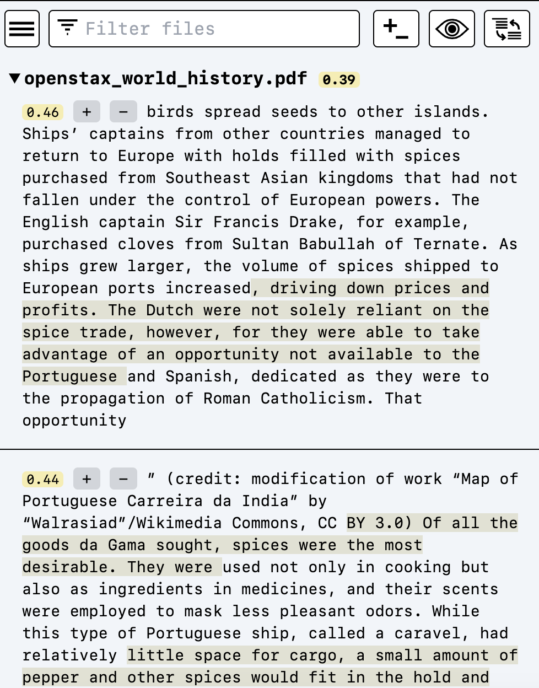

# Semantra

https://user-images.githubusercontent.com/306095/233867821-601db8b0-19c6-4bae-8e93-720b324dc199.mov

Semantra 是一个用于语义搜索文档的多功能工具，它能够根据文本含义进行查询，而非仅仅去匹配字词。

该工具通过命令行运行，能够分析你电脑上指定的文本和 PDF 文件，并启动一个本地网络搜索应用以便交互式地查询这些文件。Semantra 想让语义搜索引擎变得更加简单、友好、可定制，同时保证数据的私密性和安全性。

Semantra 的目标用户是那些在需要在大量信息中寻找关键内容的人——例如，新闻记者在截稿期限内筛选泄露的文件，研究者在众多论文中寻找独特的洞见，学生通过查询主题来深入研究文学，历史学者在多本书籍中串联事件等等。

## Resources 资源

- [教程](./tutorial.md)：一个入门级别的指南，涵盖了从安装 Semantra 到实践操作分析文档的全过程。
- [指南](./guides.md)：一些实用的指南，帮助你更深入地使用 Semantra。
- [概念](./concepts.md)：一些关键概念，以帮助你更好地理解 Semantra 的工作原理。
- [使用网页界面](./help.md)：Semantra 网页应用程序的使用说明。

本页面为您提供了 Semantra 的高级概述和功能参考。我们还提供其他语言的版本：[西班牙语版](./README_es.md)，和[英文原版](README.md)。

## 安装

确保已安装好 [Python >= 3.9](https://www.python.org/downloads/)。

安装 Semantra 的最简单方式是通过 `pipx`。如果你还没有安装 `pipx`，运行：

```sh
python3 -m pip install --user pipx
python3 -m pipx ensurepath
```

打开一个新的终端窗口，这样 `pipx` 设置的新路径就会生效。然后执行以下命令：

```sh
pipx install semantra
```

这个命令会在你的系统路径中安装 Semantra。安装完成后，你就可以在终端中运行 `semantra` 并看到相关输出。

## 使用

Semantra 可以处理存储在你的本地计算机上的文档，这些文档可以是文本或 PDF 文件。

最简单的用法是，你可以通过运行以下命令在单个文档上使用 Semantra：

```sh
semantra doc.pdf
```

你也可以在多个文档上运行 Semantra：

```sh
semantra report.pdf book.txt
```

Semantra 在首次处理文档时会需要一些时间，每份文档只需处理一次，所以后续再对同一份文档进行启动则会非常迅速。

处理完成后，Semantra 会启动一个本地 web 服务器，默认地址是 [localhost:8080](http://localhost:8080)。在这个网页上，你可以通过自然语言查询你启动时输入好的文档。

**注意事项：**

如果你要处理的文档并非英文，或者希望通过英文意外的语言进行搜索，默认模型可能无法满足你的需求。你可以使用更大、更慢的多语言模型，例如 `semantra --transformer-model intfloat/multilingual-e5-base [文件]`。

当你首次运行 Semantra 时，可能需要几分钟时间和几百兆的硬盘空间来下载机器学习模型，该模型能在本地处理你输入的文档。虽然[使用的模型可以进行自定义](./guide_models.md)，但默认模型在速度、规模和效果上都达到了良好的平衡。

如果你希望在不消耗自己的计算资源的情况下快速处理文档，并且不介意为使用外部服务付费或者与其分享数据，你可以使用[OpenAI 的嵌入模型](./guide_openai.md)。

## 网页应用程序快速浏览

当你第一次进入 Semantra 的网页界面时，你将看到如下的页面：


在搜索框中输入一些内容，按下<kbd>Enter</kbd>键或点击搜索图标，即可开始语义查询。

左侧面板会按照相关性排序：



黄色的评分显示了 0-1.00 的相关性。在 0.50 的范围内的任何内容都表示强度较高的匹配。淡褐色的高亮部分将在搜索结果上滚动显示，解释与你的查询最相关的部分。

点击搜索结果的文本，将跳转到相关文档的相关部分。


点击与搜索结果相关的加号/减号按钮，来对这些结果进行正面/负面的标记。此后重新执行查询时，这些额外的查询参数就会生效。


最后，你可以在查询文本中添加和减去文字，使用加号/减号来塑造精确的语义含义。


要更深入地了解网页应用，可以查看[教程](./tutorial.md)或[网页应用参考](./help.md)。

## 概念入门

语义搜索引擎本质上不同于文本匹配算法，所以使用方法也不一样。

首先，对于任何给定的查询，无论查询内容多么不相关，总会有搜索结果。结果的相关性得分可能很低，但结果绝不会完全消失。这是因为语义搜索的算法常常会在微小的得分差异中，包含有用的结果。结果总会按相关性排序，并且每篇文档只展示得分最高的前 10 个结果，因此得分较低的结果会自动被剔除。

另一个区别是，如果你查询文档中直接出现的内容，Semantra 不一定能找到精确的文本匹配。从高层来看，这是因为在不同的上下文中，单词可能有不同的含义，例如， “leaves” 既可以指树的叶子，也可以指某人的“离开”。Semantra 使用的嵌入模型将你输入的所有文本和查询转换成可以进行数学比较的长数字序列，这种情况下，精确的子字符串匹配就不太重要。关于嵌入的更多信息，请查看[嵌入概念](./concept_embeddings.md)的文档。

## 命令行参考

```sh
semantra [OPTIONS] [FILENAME(S)]...
```

## 命令行选项

- `--model [openai|minilm|mpnet|sgpt|sgpt-1.3B]`: 预设的嵌入模型。有关更多信息，请参阅模型指南（默认：mpnet）
- `--transformer-model TEXT`: 自定义用于嵌入的 Huggingface Transformer 模型名称（应只指定 `--model` 和 `--transformer-model` 其中一个）。有关更多信息，请参阅模型指南
- `--windows TEXT`: 要提取嵌入的窗口。格式为 "size[\_offset=0][\_rewind=0] 的逗号分隔列表。size 为 128、offset 为 0、rewind 为 16 的窗口（128_0_16）会把文本分为 128 个 token 长度的文本块，对每个文本块进行嵌入，并且让这些文本块之间重叠 16 个 token，并且只有第一个窗口会被用于搜索。有关更多信息，请参阅[窗口概念](./concept_windows.md)文档（默认：128_0_16）
- `--encoding`: 用于读取文本文件的编码 [默认: utf-8]
- `--encoding`：用于读取文本文件的编码（默认：utf-8）
- `--no-server`：不启动 UI 服务器（只处理）
- `--port INTEGER`：嵌入服务器的端口（默认：8080）
- `--host TEXT`：嵌入服务器的主机（默认：127.0.0.1）
- `--pool-size INTEGER`：在请求中池化在一起的嵌入标记的最大数量
- `--pool-count INTEGER`：在请求中池化在一起的嵌入的最大数量
- `--doc-token-pre TEXT`：添加到 Transformer 模型中每个文档前面的标记（默认：None）
- `--doc-token-post TEXT`：添加到 Transformer 模型中每个文档后面的标记（默认：None）
- `--query-token-pre TEXT`：添加到 Transformer 模型中每个查询前面的标记（默认：None）
- `--query-token-post TEXT`：添加到 Transformer 模型中每个查询后面的标记（默认：None）
- `--num-results INTEGER`：每个文件的查询结果（邻居）数量（默认：10）
- `--annoy`：使用 Annoy 进行近似 kNN 查询（查询更快，但精度略有损失）；如果为假，则使用精确的穷举 kNN（默认：True）
- `--num-annoy-trees INTEGER`：用于通过 Annoy 进行近似 kNN 的树的数量（默认：100）
- `--svm`：使用 SVM 而不是任何类型的 kNN 进行查询（较慢，只适用于对称模型）
- `--svm-c FLOAT`：SVM 正则化参数；较高的值会更多地惩罚误报（默认：1.0）
- `--explain-split-count INTEGER`：用于解释查询的给定窗口的分割数量（默认：9）
- `--explain-split-divide INTEGER`：用于获取解释查询的每个分割长度的窗口大小除数（默认：6）
- `--num-explain-highlights INTEGER`：用于解释查询的分割结果的突出显示数量（默认：2）
- `--force`：强行重新处理已缓存过的文档
- `--silent`：不打印进度信息
- `--no-confirm`：处理 OpenAI 之前不显示成本确认
- `--version`：打印版本并退出
- `--list-models`：列出预设模型并退出
- `--show-semantra-dir`：打印 Semantra 将用于存储处理文件的目录并退出
- `--semantra-dir PATH`：指定存储 Semantra 文件的目录
- `--help`：显示此消息并退出

## 常见问题

### 能使用 ChatGPT 吗？

不能，这是故意设计成这样的。

Semantra 并不依赖于任何像 ChatGPT 这样的生成模型。它仅被设计为在没有进行任何解释、总结或合成结果的额外层面上进行语义查询。生成语言模型偶尔会产生看似合理，但最终错误的信息，从而让用户不得不返回信息源头去进行校验。相比之下，Semantra 将原始资料作为唯一的真理来源，力图证明在简单的嵌入模型基础之上，采用人在环中的搜索体验对用户更加有利。

## 开发

Python 应用程序位于`src/semantra/semantra.py`，并作为标准 Python 命令行项目通过 `pyproject.toml` 进行管理。

本地网络应用程序使用 [Svelte](https://svelte.dev/) 编写，并以标准的 npm 应用程序进行管理。

若要为 web 应用程序进行开发，通过 `cd` 进入`client`，然后运行 `npm install`。

要构建 web 应用程序，运行`npm run build`。要在观察模式下构建 web 应用程序并在有更改时重新构建，运行`npm run build:watch`。

## 贡献

该应用程序仍处于早期阶段，但欢迎大家做出贡献。如有任何错误或功能需求，请随时提交 Issues。
